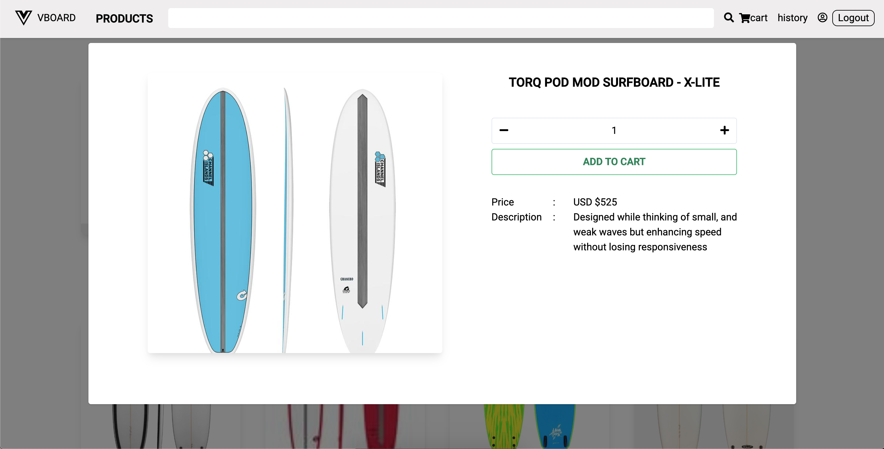

# mini-ecommerce

Ecommerce app built using Vue.js and Node.js
- Two roles are available (`seller` and `customer`)
- Can track the transaction progress (`unpaid`, `paid`, `confirmed`, `shipped`, etc)

